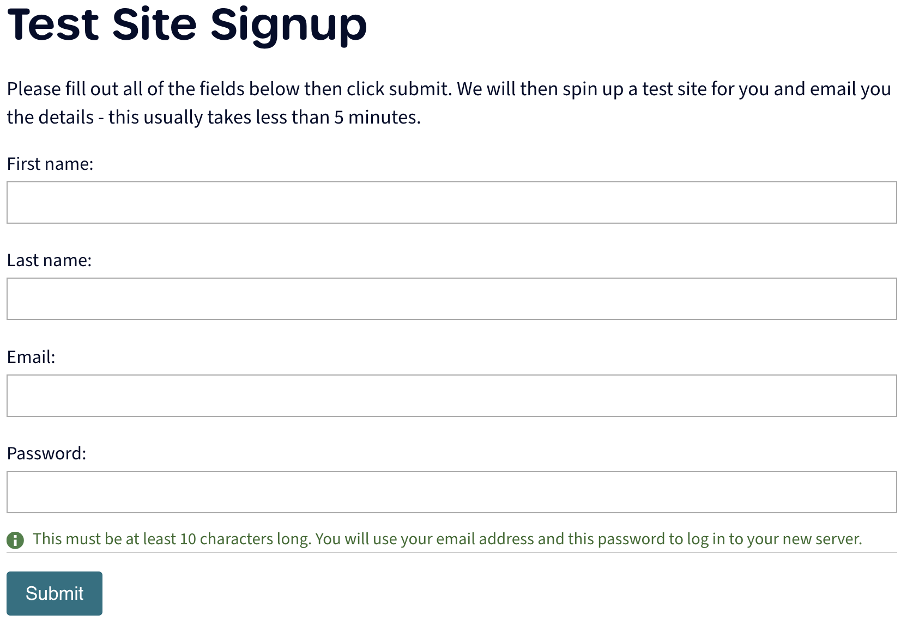

# Ampletracks instance-on-demand

We try to make Ampletracks as easy to test as possible for interested parties, so we provide a limited time period test site for you to use and explore Ampletracks. The site will be instantiated with record types and records from and example set up on <https://demo.ampletracks.com>. The example is based on one of our tutorials, which can be found on the [extended Ampletracks user tutorial](./ampletracks_demo_extended.md).

Your test site will be available for you to use for up to 1 week from instantiation, after which it will be deleted. We do not store anything you configure on your test version.

```{warning}
Since the test website you will be setting up will be destroyed within a week of instantiating, please take care to not input any important details you cannot retrieve.
```

## How to get a test Ampletracks site

1. Navigate to <https://demo.ampletracks.com/iod//> on your preferred web browser
   ```{note}
   The double '/' is important and not a typo
   ```
2. Fill in your details - we will not keep these, they will only be used to set up your test version of Ampletracks
   
3. Check the inbox of the email you supplied on the form, you will have received an email informing you that your test site is being prepared
4. Wait 2 - 10 minutes
5. Check that you have received an email with a link to your test site (be sure to save the email or the link to the site)
6. Navigate to your test site
7. Log in using the email and password details you provided when you requested the site